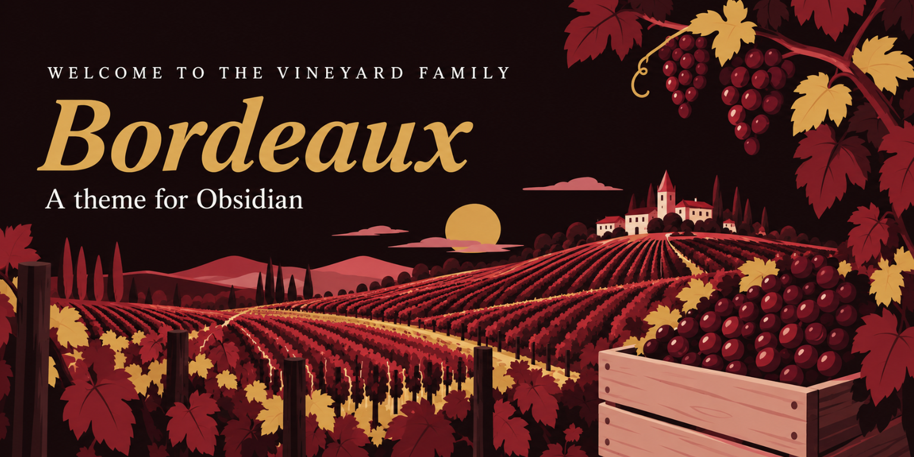
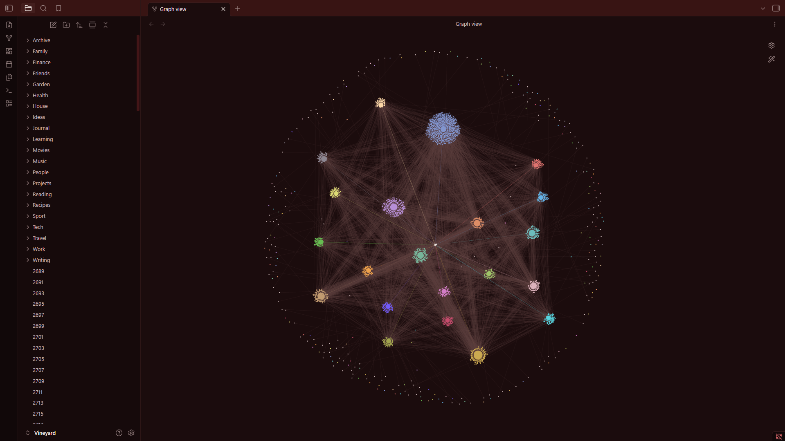
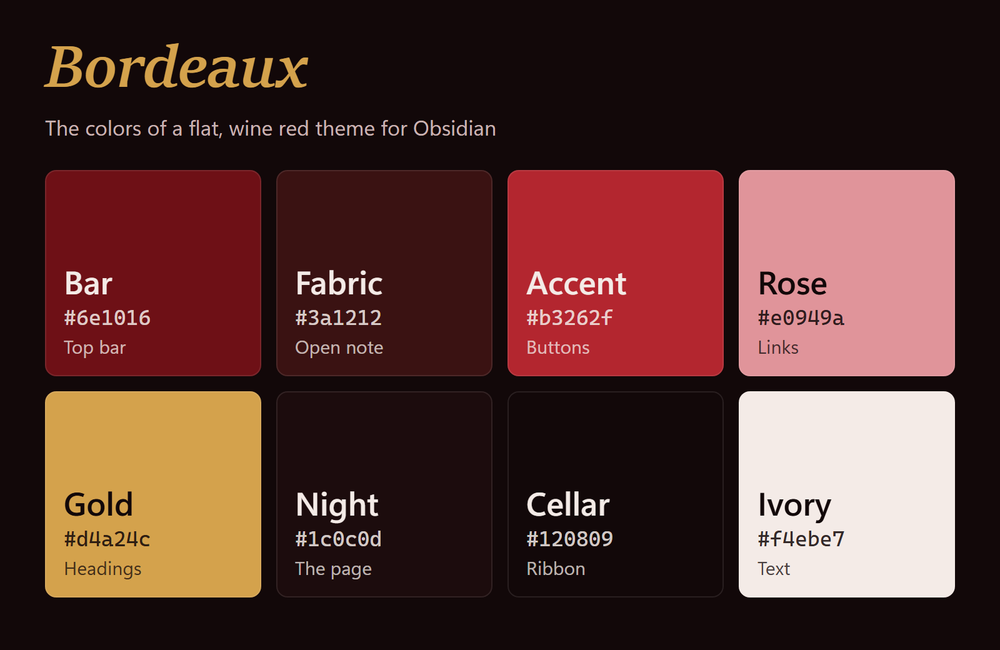
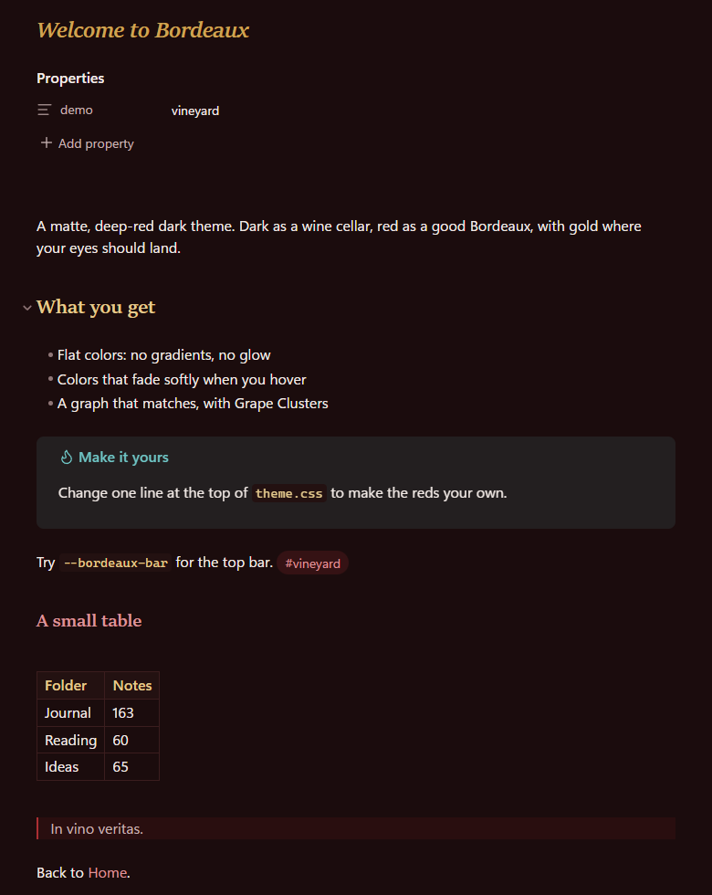

# Bordeaux



## The Vineyard family

Vineyard is what I call the little Obsidian things I make and give away. There are two so far. They work fine on their own, but they look best together.

| | 💎 Obsidian | 🐙 GitHub |
|---|---|---|
| 🍷 **Bordeaux**, the theme on this page | [Theme page](https://community.obsidian.md/themes/bordeaux) | [Repository](https://github.com/creativemindrito/bordeaux-theme-obsidian) |
| 🍇 **Grape Clusters**, the plugin that groups the graph below by folder | [Plugin page](https://community.obsidian.md/plugins/grape-clusters) | [Repository](https://github.com/creativemindrito/grape-clusters-obsidian) |

A dark wine red theme for Obsidian. I wanted something I could write in for hours without it getting loud, so everything is flat. No gradients and no glow. The only thing that moves is a quick color fade when you hover over something.



This is Bordeaux in a test vault with 3,000 notes. The graph gets the same dark page, and its lines are a muted wine color. The folders pull together into clusters thanks to Grape Clusters, and each folder's color comes from the *Groups* setting in the graph.

## Install

There are three ways. Pick the one you like.

- **In Obsidian:** open *Settings → Appearance* and click *Manage* next to Themes. Search for Bordeaux and click *Install and use*.
- **On the Obsidian website:** open the [Bordeaux page](https://community.obsidian.md/themes/bordeaux) and click *Add to Obsidian*. Obsidian opens on the theme, and you click *Install and use*.
- **By hand:** download `theme.css` and `manifest.json` from the [latest release](https://github.com/creativemindrito/bordeaux-theme-obsidian/releases/latest) and put them in a folder called `Bordeaux` inside `.obsidian/themes/` in your vault. Then pick Bordeaux under *Settings → Appearance*.

## The colors



These are the eight colors you'll see the most. The reds and the gold sit at the very top of `theme.css`, one line each.

## Writing



This is where you spend most of your time, so I kept it calm. Headings are gold and set in a serif, links are a soft rosé, and the page is nearly black with a little red in it.

## Make it yours

To change one of the reds, copy its line into a CSS snippet (*Settings → Appearance → CSS snippets*). That way an update never undoes it:

```css
.theme-dark {
  --bordeaux-bar: #6e1016;
  --bordeaux-fabric: #3a1212;
  --bordeaux-accent: #b3262f;
  --bordeaux-rose: #e0949a;
  --bordeaux-gold: #d4a24c;
}
```

## Good to know

Dark mode only for now. It's plain CSS and it doesn't load anything from the internet.

## Made by

[creativemindrito](https://github.com/creativemindrito). Free to use under the [MIT license](LICENSE). Something looks off? Open an issue and I'll take a look.
